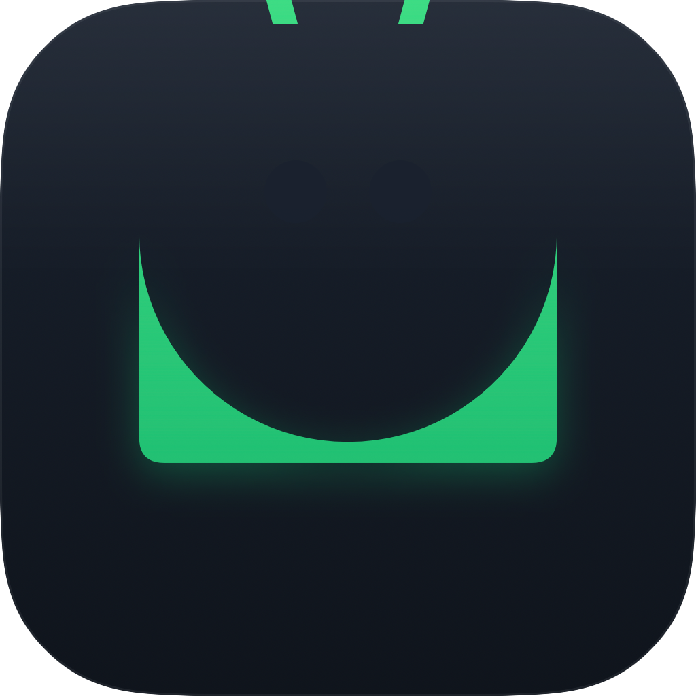

<div align="center">
  <a href="FreeDroid/Resources/Assets.xcassets/AppIcon.appiconset/icon_512x512@2x.png">
    
  </a>

# FreeDroid

*Android, in Finder. Open source. macOS-native.*

[](https://www.apple.com/macos/)
[](https://swift.org)
[](https://github.com/merkost/FreeDroid/actions)
[](LICENSE)
[](https://github.com/merkost/FreeDroid/releases)

</div>

---

## What it does

Plug in your Android device, FreeDroid shows it in Finder's Locations sidebar — no System Settings toggle, no kernel extensions, no macFUSE. Browse `/sdcard` directly, preview files with Quick Look, and drag files in either direction. ADB gives you full filesystem access when USB debugging is on; MTP works without it. Multiple devices are handled simultaneously, each as its own location.

---

## Features

<table>
  <tr>
    <td>📂 <strong>Finder integration</strong><br>Device appears under Locations via <code>NSFileProviderReplicatedExtension</code>. No FSKit, no System Settings, no reboot.</td>
    <td>⚡ <strong>ADB + MTP transports</strong><br>Bundled <code>adb</code> binary for full filesystem speed; libmtp for no-debug-mode devices. Auto-selects ADB when authorized.</td>
  </tr>
  <tr>
    <td>🗂 <strong>In-app file browser</strong><br>Sort, multi-select, rename, delete, mkdir. Breadcrumb navigation and keyboard shortcuts throughout.</td>
    <td>🔍 <strong>Inspector side panel</strong><br>Thumbnails, metadata, Open and Show in Finder actions for any selected file.</td>
  </tr>
  <tr>
    <td>👁 <strong>Quick Look previews</strong><br>Press Space on any file for a native Quick Look preview without transferring it first.</td>
    <td>🖼 <strong>Photo Gallery</strong><br>Masonry grid with async thumbnails, date sections, and a folder picker to scope your view.</td>
  </tr>
  <tr>
    <td>📤 <strong>Transfer queue</strong><br>Progress tracking, command strip, and toast notifications. Files land in <code>~/Downloads/FreeDroid/&lt;device&gt;/</code>.</td>
    <td>🎨 <strong>macOS-native UI</strong><br>Big Sur materials, light and dark themes, motion presets. Feels at home on macOS 15.</td>
  </tr>
  <tr>
    <td>🔄 <strong>Sparkle in-app updates</strong><br>Ships with Sparkle 2 for seamless update delivery once the release pipeline is live.</td>
    <td>📖 <strong>Open source, MIT</strong><br>No telemetry, no paywall, no subscription. Fork it, ship it, improve it.</td>
  </tr>
</table>

---

## Screenshots

<table>
  <tr>
    <td align="center">
      <br>
      <em>Screenshots coming soon</em>
    </td>
    <td align="center">
      <br>
      <em>Screenshots coming soon</em>
    </td>
  </tr>
  <tr>
    <td align="center">
      <br>
      <em>Screenshots coming soon</em>
    </td>
    <td align="center">
      <br>
      <em>Screenshots coming soon</em>
    </td>
  </tr>
</table>

---

## Supported devices

FreeDroid recognises **65+ Android OEM USB vendor IDs** — if your phone is on this list, it shows up in the sidebar as soon as it's plugged in (ADB if USB Debugging is on, MTP otherwise). Most popular brands are covered:

<table>
  <tr>
    <td><strong>Google</strong> · Pixel</td>
    <td><strong>Samsung</strong> · Galaxy</td>
    <td><strong>Xiaomi</strong> · Mi, Redmi, POCO</td>
    <td><strong>OnePlus</strong></td>
  </tr>
  <tr>
    <td><strong>Oppo</strong></td>
    <td><strong>Realme</strong></td>
    <td><strong>Vivo</strong></td>
    <td><strong>Huawei</strong></td>
  </tr>
  <tr>
    <td><strong>Honor</strong></td>
    <td><strong>Motorola</strong></td>
    <td><strong>Sony</strong> · Xperia</td>
    <td><strong>LG</strong></td>
  </tr>
  <tr>
    <td><strong>HTC</strong></td>
    <td><strong>ASUS</strong> · ROG, Zenfone</td>
    <td><strong>Lenovo</strong></td>
    <td><strong>Nothing</strong></td>
  </tr>
  <tr>
    <td><strong>Nokia / HMD</strong></td>
    <td><strong>TCL / Alcatel</strong></td>
    <td><strong>ZTE</strong></td>
    <td><strong>Tecno / Infinix</strong></td>
  </tr>
  <tr>
    <td><strong>Wiko / Tinno</strong></td>
    <td><strong>Hisense</strong></td>
    <td><strong>Sharp</strong></td>
    <td><strong>Kyocera</strong></td>
  </tr>
  <tr>
    <td><strong>Panasonic</strong></td>
    <td><strong>Pantech</strong></td>
    <td><strong>Coolpad</strong></td>
    <td><strong>Acer Mobile</strong></td>
  </tr>
  <tr>
    <td><strong>Archos</strong></td>
    <td><strong>BLU</strong></td>
    <td><strong>Cubot</strong></td>
    <td><strong>Doogee</strong></td>
  </tr>
  <tr>
    <td><strong>Wileyfox</strong></td>
    <td><strong>Highscreen</strong></td>
    <td><strong>BlackBerry</strong></td>
    <td>…and most generic Android tablets</td>
  </tr>
</table>

Don't see your brand? File an issue with the output of `system_profiler SPUSBDataType | grep -B1 'Vendor ID'` and we'll add it. The full table lives in [`Sources/FreeDroidData/USB/AndroidVendorIDs.swift`](Sources/FreeDroidData/USB/AndroidVendorIDs.swift) — PRs welcome.

---

## Quick start

```bash
git clone https://github.com/merkost/FreeDroid.git
cd FreeDroid
cp Configs/Local.xcconfig.example Configs/Local.xcconfig
# edit Configs/Local.xcconfig → set DEVELOPMENT_TEAM to your Apple Developer Team ID
open FreeDroid.xcworkspace
# press ⌘R
```

The Run scheme's post-action automatically copies the build to `/Applications/FreeDroid.app` and re-registers the File Provider extension — required because macOS won't accept provider extensions from DerivedData.

---

## Under the hood

FreeDroid is three Darwin processes working together:

- **`FreeDroid.app`** — SwiftUI host (macOS 15.4+, Swift 6 strict concurrency). Runs `ProviderDomainCoordinator`, which registers one `NSFileProviderDomain` per authorized ADB device. Hosts the in-app browser, gallery, transfer queue, and inspector.
- **`FreeDroidProvider.appex`** — `NSFileProviderReplicatedExtension`. macOS spawns one instance per domain; each domain appears as a device in Finder under Locations. Handles list, fetch, create, rename, replace, and delete.
- **`FreeDroidBridge.xpc`** — XPC service embedded inside both the host app and the appex (`Contents/XPCServices/`). Spawns the bundled `adb` binary and serves IPC requests from the extension via `NSXPCConnection(serviceName:)`.

Swift packages under `Sources/` provide the domain (`FreeDroidDomain`), design system (`FreeDroidUI`), transports (`FreeDroidADB`, `FreeDroidMTP`), data layer (`FreeDroidData`), IPC types (`FreeDroidIPC`), and feature modules (`DeviceManagement`, `FileBrowser`, `Gallery`, `Transfer`).

```
FreeDroid.app
    │
    ├── FreeDroidBridge.xpc  ◄──── NSXPCConnection ────► FreeDroidProvider.appex
    │        │                                                      │
    │        └── adb (bundled binary)                   NSFileProvider framework
    │                                                               │
    └── Finder Locations sidebar ◄─────────────────────────────────┘
```

See [`PROJECT_STATUS.md`](PROJECT_STATUS.md) for the working / known-issue map.

---

## Building from source

**Requirements:**

- macOS 15.4 Sequoia or newer
- Xcode 26 or newer
- An Apple Developer Team ID (free or paid)
- An Android device with a USB cable (optional — the app builds and runs without one)

No additional tools are required for a standard build. `xcodegen` and `swiftlint` are only needed if you regenerate the `.xcodeproj` from `project.yml`.

---

## Contributing

See [`CONTRIBUTING.md`](CONTRIBUTING.md) for coding rules, signing setup, commit conventions, and the PR workflow.

---

## License

MIT — see [`LICENSE`](LICENSE).

Third-party component licenses are listed in [`THIRD_PARTY_NOTICES.md`](THIRD_PARTY_NOTICES.md).

---

## Credits

- [Sparkle](https://sparkle-project.org) — in-app software updates
- [libmtp](https://libmtp.sourceforge.net) / [libusb](https://libusb.info) — MTP transport (LGPL, dynamically linked)
- [Android Open Source Project](https://source.android.com) — bundled `adb` binary (Apache 2.0)
